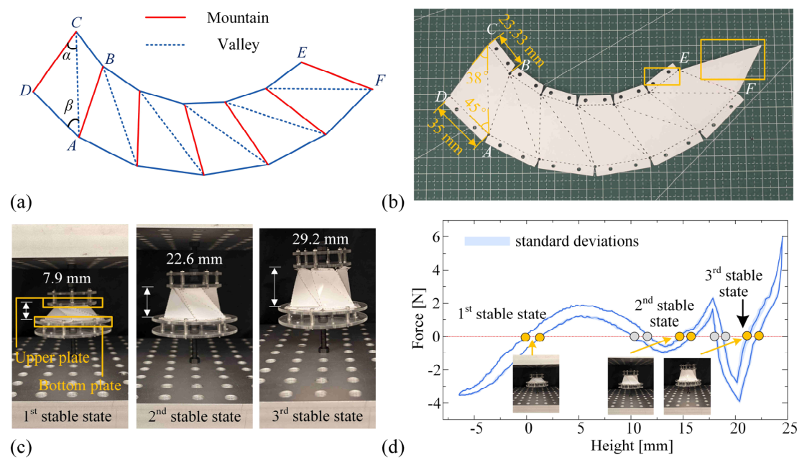
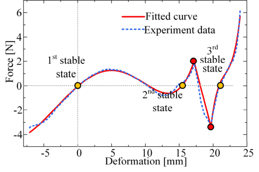
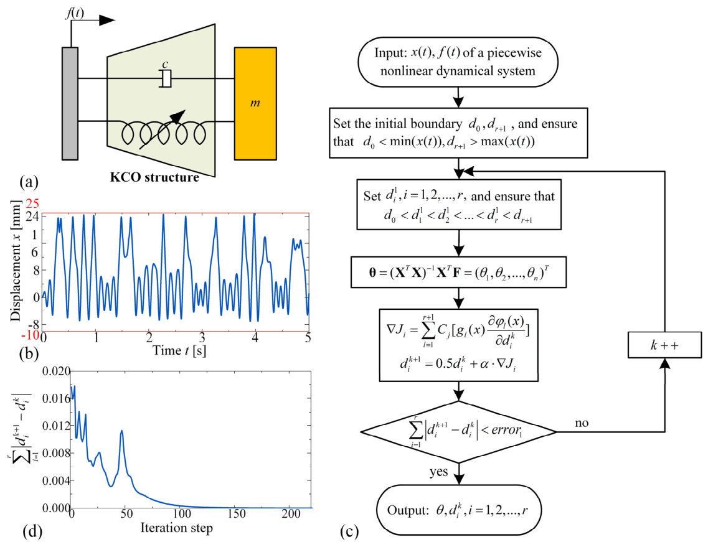
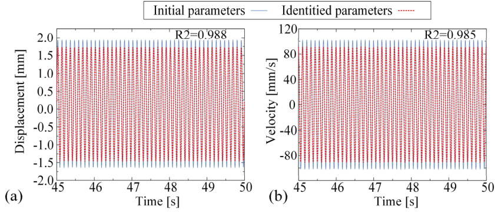
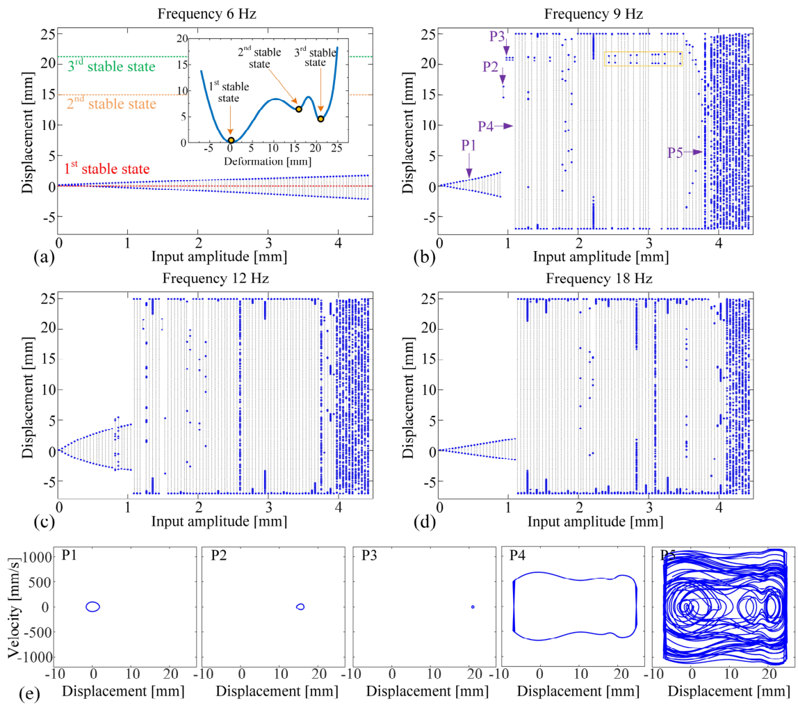
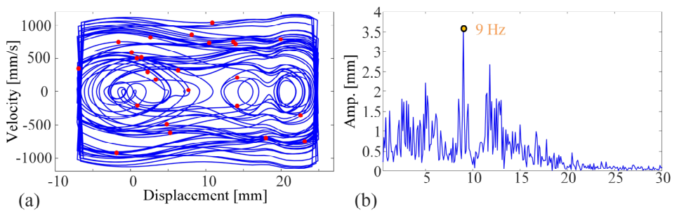
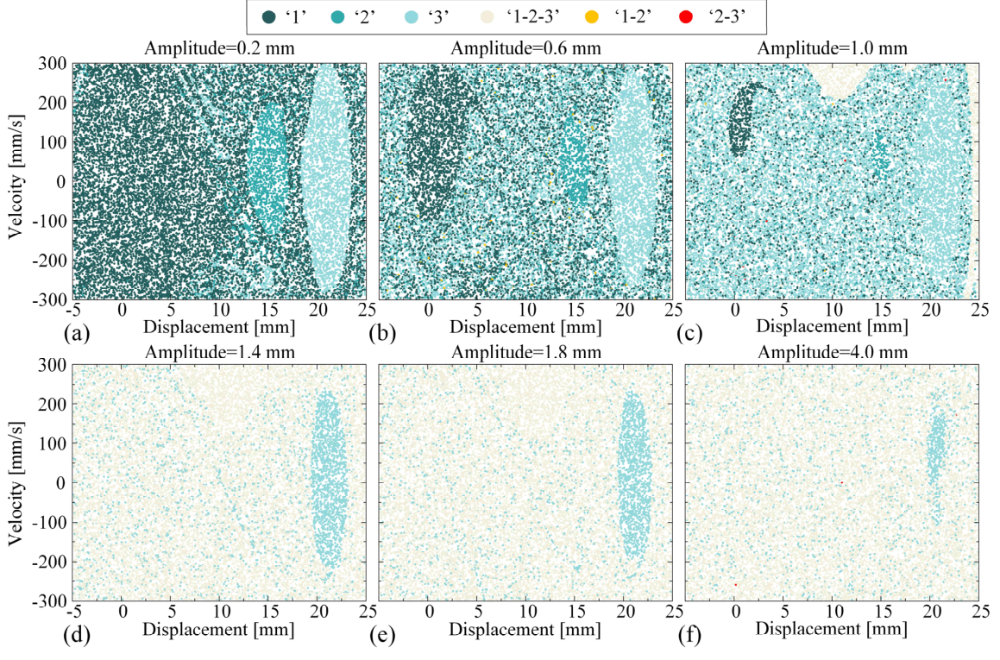
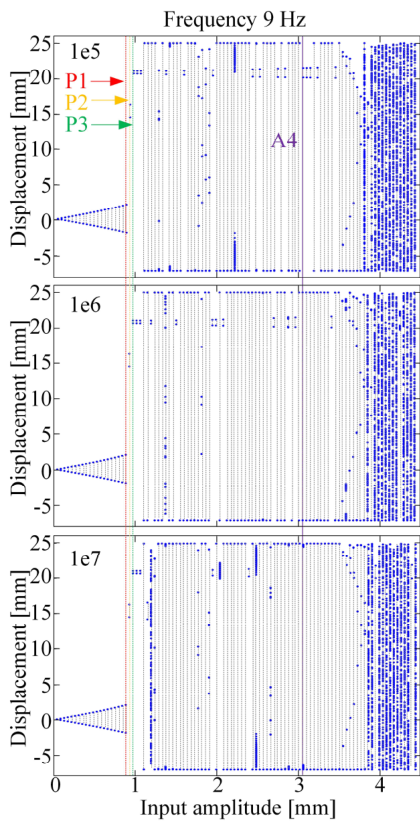

# Kresling Conical Origami Dynamics — Piecewise System Identification (MATLAB)

> MATLAB implementation of the **piecewise system identification** method for the
> **Kresling Conical Origami (KCO)** presented in the companion paper. This repository
> contains the code that reconstructs the nonlinear restoring-force model of a tri-stable
> KCO from experimental time-history data.

---

## Paper / 论文

**The modeling and dynamic analysis of the Kresling Conical Origami**
Xinyue Xiang, and XX\*
*Institute of Mathematics, Shanghai Maritime University, Haigang Ave 1550, Shanghai 201306, China*
*(Draft / preprint — manuscript ID: CND-25-1238)*

- 🖼️ **在线阅读（逐页图片，GitHub 可直接预览）**：[`paper.md`](paper.md)
- 📄 Full text (PDF，供下载): [`papers/DRAFT-CND-25-1238-1.pdf`](papers/DRAFT-CND-25-1238-1.pdf)

> GitHub 的 PDF 在线预览对本文原文件兼容性不佳，故已将 21 页全文转为图片置于 [`paper_pages/`](paper_pages)，并在 [`paper.md`](paper.md) 中按顺序展示，确保可直接阅读。

### Abstract

Multi-stable origami structures have attracted wide attention across various fields due to their
unconventional mechanical properties, such as reconfigurability and tunable stiffness. However,
current studies mainly focus on the static properties of multi-stable origami structures. To advance
the state of the art, this research chooses the Kresling conical origami (KCO) as the platform.
Different from the normal Kresling structure, the KCO possesses three stable states and a piecewise
non-smooth constitutive curve. The whole KCO structure could be equivalently represented as a
nonlinear spring-damper system, and its dynamic model is reconstructed using a piecewise system
identification method. Based on the model, the numerical simulation could be performed. The
bifurcation analysis with respect to external excitation amplitude reveals various response types of
the KCO structure, along with the transition processes between them. Furthermore, we also analyze
the basin of attraction to understand how different responses evolve with changes in initial conditions.
Overall, this study proposes a systematic approach for investigating the dynamics of multi-stable
origami structures and provides a theoretical foundation for the control of their dynamic behaviors.

**Keywords:** Origami, Nonlinear dynamics, non-smooth system, piecewise system identification

---

## Overview / 研究概述

Kresling 锥形折纸（KCO）是一种**三稳态**折纸结构，其力-位移本构曲线呈**分段非光滑**特征
（两个断点 **d₁ = 17.2 mm, d₂ = 19.7 mm**）。本仓库的代码将 KCO 等效为非线性弹簧-阻尼系统，
并采用 **Liu et al. (2019) 基于高斯函数的分段系统辨识方法**，从实验测得的时间历程数据
（位移、速度、激励）中识别出恢复力函数 *f(x)* 及各段多项式系数。

几何参数（Table 1）：`l = 35 mm, rₐ = 2/3, num = 6, α = 38°, β = 45°`；
三稳态高度：7.9 / 23.3 / 29.2 mm。

<p align="center">
  
</p>
<p align="center"><b>Fig. 1</b> Design, fabrication and testing of the Kresling conical origami (KCO). / KCO 的设计、制备与实验。</p>

<p align="center">
  
</p>
<p align="center"><b>Fig. 2</b> Fitted curve and experimental data of the force-displacement relationship. / 力-位移关系拟合曲线与实验数据。</p>

---

## Methodology / 方法（对应代码）

论文第 3 节的数学框架与代码逐一对应该：

1. **等效模型**：`1000·(m·ẍ + c·ẋ + f(x)) = f(t)`，单位 kg·mm·s（Eq. 3）。
2. **高斯权重函数** `ϕᵢ(x)`（Eq. 5–8）：`ϕᵢ = Gᵢ / ΣGⱼ`，
   `Gᵢ = exp(-(x-μᵢ)² / 2σᵢ²)`，`μᵢ` 取区间中心，`σᵢ = γ·(dᵢ-dᵢ₋₁)`
   （γ 为比例因子，取极小以保证各区间仅一个权重被激活）。 → `phi1/2/3.m`
3. **B-spline Galerkin 积分**：用三次 B 样条基 `B(t)` 重构位移与激励，积分得到速度/加速度，
   既抑制噪声又保证连续性。 → `BSPLINE.m` / `DBSPLINE.m` / `DDBSPLINE.m`
4. **最小二乘求解**：化为 `X·θ = F`，`θ = (XᵀX)⁻¹XᵀF`（Eq. 15–17）。
5. **梯度下降更新非光滑点**：对非光滑点 d₁/d₂ 求梯度并更新，直至收敛。 → `d1_phi*/d2_phi*.m`

<p align="center">
  
</p>
<p align="center"><b>Fig. 3</b> Parameter identification algorithm and dynamic system of the KCO. / KCO 参数辨识算法与动力学系统。</p>

---

## Repository structure / 文件说明

```
Kresling-Conical-Origami-Dynamics/
├── kco_piecewise_identification.m     # 主程序：分段系统辨识 + 梯度下降更新 d1/d2
├── BSPLINE.m                         # 三次 B 样条基函数 B(t)
├── DBSPLINE.m                        # B 样条一阶导数
├── DDBSPLINE.m                       # B 样条二阶导数
├── phi1.m / phi2.m / phi3.m          # 三段高斯权重 ϕ₁ / ϕ₂ / ϕ₃
├── d1_phi1.m / d1_phi2.m / d1_phi3.m # ϕ 对 d₁ 的偏导（更新 d₁ 用）
├── d2_phi1.m / d2_phi2.m / d2_phi3.m # ϕ 对 d₂ 的偏导（更新 d₂ 用）
├── data6.mat                         # 辨识实验数据（列：时间 / 位移 x / 速度 dx）
├── figures/
│   ├── fig1_design_fabrication_testing.png  # Fig.1
│   ├── fig2_force_displacement_fit.png      # Fig.2
│   ├── fig3_identification_algorithm.png    # Fig.3
│   ├── fig4_identification_accuracy.png     # Fig.4
│   ├── fig5_bifurcation_diagrams.png          # Fig.5
│   ├── fig6_chaos_analysis_p5.png             # Fig.6
│   ├── fig7_basins_of_attraction.png        # Fig.7
│   └── figA1_penalty_bifurcation.png        # Fig.A1
├── papers/
│   └── DRAFT-CND-25-1238-1.pdf       # 论文全文（PDF，供下载）
├── paper_pages/                       # 论文逐页图片（21 页，GitHub 可直接预览）
│   ├── page_01.png … page_21.png
├── paper.md                           # 论文全文在线阅读入口（图片版）
├── README.md
└── LICENSE
```

---

## How to run / 使用方法

**Requirements:** MATLAB (R2021a or later recommended).

```matlab
% 1. 将本仓库根目录下所有 .m 与 data6.mat 放在同一 MATLAB 工作目录
% 2. 运行主程序
kco_piecewise_identification
```

**Outputs:**
- `theta_hat` — 辨识得到的参数向量（质量 m、阻尼 c、各段多项式系数）
- 收敛后的非光滑点 `d1`, `d2`

> ⚠️ 本仓库对应的是论文 **第 3 节（参数辨识）** 的代码。论文第 4 节的数值仿真（RK4）、
> 分岔分析与吸引域分析代码不在此仓库中。

---

## Key results / 主要结果（详见论文）

- 静态力-位移拟合与实验数据相关性系数 **R² = 0.993**（page 5 / Fig. 2）。
- 动态辨识得到的各段多项式系数相对误差 **< 3.08%**（详见论文 Table 3）。
- 在 **9 Hz** 外激励下，随振幅增大依次出现：周期内振动 → 跨阱振动 → **混沌**
  （P5，振幅 3.864 mm；Poincaré 截面稠密点 + FFT 连续谱证实混沌）。
- 吸引域（basin of attraction）分析揭示不同响应随初值演化的规律与触发概率。

<p align="center">
  
</p>
<p align="center"><b>Fig. 4</b> Accuracy of dynamic simulations based on identified parameters: (a) displacement, (b) velocity. / 基于辨识参数的动态仿真精度：(a) 位移，(b) 速度。</p>

<p align="center">
  
</p>
<p align="center"><b>Fig. 5</b> Bifurcation diagrams under excitation frequencies (a) 6 Hz, (b) 9 Hz, (c) 12 Hz, (d) 18 Hz, and phase portraits (e). / 不同激励频率下的分岔图 (a–d) 与相图 (e)。</p>

<p align="center">
  
</p>
<p align="center"><b>Fig. 6</b> Chaos analysis of the dynamic response at point P5: (a) Poincaré section, (b) FFT spectrum. / P5 点混沌响应分析：(a) Poincaré 截面，(b) FFT 频谱。</p>

<p align="center">
  
</p>
<p align="center"><b>Fig. 7</b> Basins of attraction on the displacement-velocity plane corresponding to 6 excitation amplitudes. / 6 种激励振幅下位移-速度平面上的吸引域。</p>

## Appendix / 附录

<p align="center">
  
</p>
<p align="center"><b>Fig. A1</b> Bifurcation diagrams of the KCO structure for three different penalty values. / 三种惩罚值下的分岔图。</p>

---

## Citation / 引用

```bibtex
@misc{xiang2025modeling,
  title  = {The modeling and dynamic analysis of the Kresling Conical Origami},
  author = {Xiang, Xinyue and others},
  year   = {2025},
  note   = {Preprint / draft, manuscript ID CND-25-1238, Shanghai Maritime University}
}
```

## License

Released under the [MIT License](LICENSE).
